# CLAUDE.md — Spring AI Alibaba Admin

## 项目定位

**Agent Studio**：基于 Spring AI Alibaba 的 AI Agent 开发与评估平台，提供从 Prompt 工程、数据集管理、评估器配置到实验执行与结果分析的完整 Agent 生命周期管理。

## 核心架构

五层架构：Frontend (React 18) → Backend (Spring Boot 3.3) → Middleware → Database。外部对接 AI 模型提供商与 Agent 应用。


## 关键模块

| 模块 | 职责 |
|------|------|
| **server-start** | Spring Boot 应用入口，REST API + Controller/Service/Repository 层 |
| **server-core** | 核心业务引擎：Agent 执行、RAG 检索、Workflow 编排、MCP 集成 |
| **server-runtime** | 运行时领域模型：DTO / Enum / Exception，零 Spring 依赖 |
| **server-openapi** | 外部 Agent 调用入口：ChatController + ApiKeyAuthInterceptor |

模块依赖关系：



外部依赖概览：


## 关键约定

- **JDK 17**，Spring Boot 3.3.6，Spring AI 1.1.x
- **双 ORM**：agentscope 库用 MyBatis Plus，admin 库用 Spring Data JPA
- **双数据库**：`agentscope`（Agent 平台核心数据，15 张表）+ `admin`（评估 + Prompt，12 张表）
- **Lombok** + SLF4J，禁止 `System.out.println`
- API 统一返回 `Result<T>`，分页用 `PagingList<T>` 或 `PageResult<T>`
- 流式响应用 `SseEmitter`（对话）或 `Flux<T>`（Prompt 运行）

## 怎么跑

```shell
# 1. 启动中间件（dev 仅 MySQL，prod 含所有中间件）
cd docker/middleware && sh run.sh dev    # 或 prod

# 2. 启动后端
mvn spring-boot:run   # 或 ./mvnw -pl spring-ai-alibaba-admin-server-start spring-boot:run

# 3. 启动前端
cd frontend/packages/main && npm run dev
```

访问 http://localhost:8000

## 参考资料

| 文档 | 内容 |
|------|------|
| [API 接口清单](docs/api-list.md) | 32 个 Controller、183 个 REST 端点，按模块分组 |
| [核心数据模型](docs/data-model.md) | 27 张表、4 大域、全部枚举值 |
| [ER 关系图](docs/data-model-er.svg) | 实体关系可视化 |

## 禁区

> （待补充：不该做的事、禁止的写法、已知的反模式）

## 历史包袱

> （待补充：遗留代码、临时方案、待重构区域、废弃功能）
